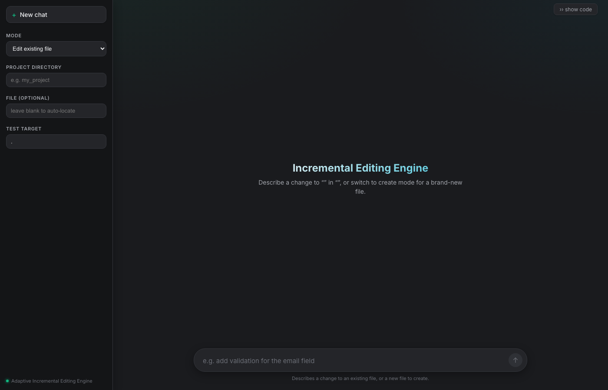
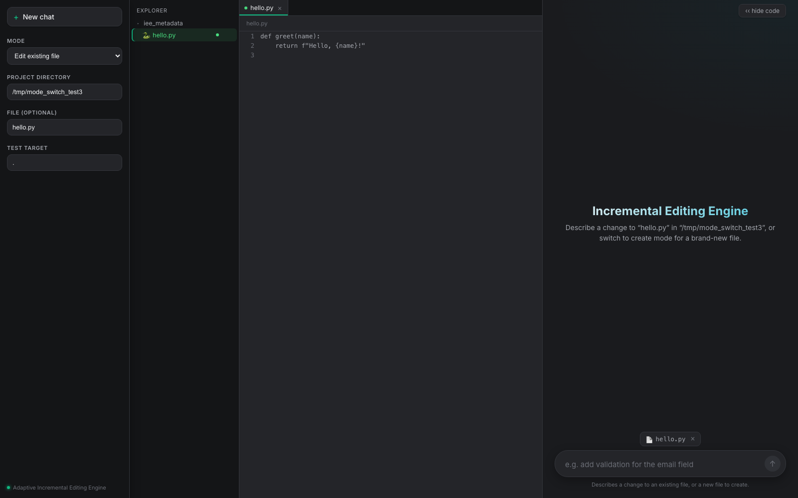

<div align="center">

# ⚡ Incremental Editing Engine

**Stop paying whole-file prices for one-line changes.**

Locates the exact function, block, or region a request touches — sends *only that* to the model — and refuses, by policy, to fall back to regenerating the whole file.

[](https://www.python.org/)
[](./frontend)
[](#storage)
[](./tests)
[](#known-gaps--honest-limitations)



</div>

---

## The problem

Ask a typical AI coding tool to "add validation to `login`" in a 2,000-line file, and most of them do the same thing under the hood: send the whole file in, get the whole file back out. You pay for and re-verify 1,999 lines that never needed to change.

**Core thesis of this project:** an edit should cost roughly proportional to *how much actually changed*, not to *how big the file is*.

```
minimize:  tokens_in + tokens_out + latency + risk_of_wrong_edit
subject to:  correctness (syntax valid, tests pass, semantically right)
```

Every mechanism in this repo — the locator, the Delta IR, the mechanical fast paths, hybrid retrieval, the escalate contract — is a lever on that trade. Where a genuine whole-file rewrite is unavoidable (a brand-new file, a language conversion), it's because the situation structurally requires it — never because the system defaulted to the expensive path out of convenience.

## ✨ What it actually does

| | |
|---|---|
| 🎯 **Targeted edits** | `analyzer/locator.py` finds the *one* function/class/block a request touches — zero LLM calls, AST + word-overlap scoring |
| 🧩 **Delta IR** | Every change is `REPLACE` / `INSERT` / `DELETE` on a named symbol — never a full-file diff |
| 🚫 **Whole-file regen refused, by policy** | Editing an existing file can't fall back to a full rewrite — it fails cleanly (`WHOLE_FILE_BLOCKED`) instead |
| 🧱 **Module-level block editing** | Config lists, `__main__` guards, and other symbol-less content get their own narrow locate-and-splice path |
| 🌍 **Multi-language** | Python via `ast`; everything else (Go, JS/TS, Java, C++, Rust, Ruby, …) via Tree-sitter, generically |
| 🔍 **Hybrid retrieval** | Symbol match + BM25 + vector search fused by reciprocal-rank, for the rare request that shares only a body word with the right target |
| 🗄️ **Binary artifacts** | `.xlsx`/`.db`/`.docx`/`.pdf` creation runs the model's own generator script once and captures the real bytes — never ships a script mislabeled as the file |
| 🔧 **Mechanical fast paths** | Exact-match rename/delete skip the LLM entirely when the target is already unambiguous |
| 🛡️ **Refuse over guess** | Every locator in this codebase returns "no confident match" rather than a wrong one — ambiguity always escalates, never silently picks |
| 💰 **Honest cost accounting** | Every run reports real input/output/cached tokens, latency, and estimated USD cost — including the $0 refusals |

<div align="center">

</div>

## 🚀 Quickstart

```bash
python3 -m venv .venv
source .venv/bin/activate
pip install -e .                 # registers the `iee` command
cp .env.example .env             # fill in OPENAI_API_KEY (and OPENAI_BASE_URL if using a gateway)
```

Config loads from `.env` automatically (`pydantic-settings`) — no `source .env` needed anywhere.

Storage defaults to local disk (`./minio_local_data`), laid out exactly like a real MinIO bucket. Set `MINIO_ENDPOINT` in `.env` to point at a running MinIO instance instead — see [`docker-compose.yml`](./docker-compose.yml) for a ready-to-run container.

### Run the offline tests

No LLM or MinIO/Docker needed:

```bash
pytest tests/ -v
```

## 🛠️ Usage

```bash
# edit an existing file — localize -> generate delta -> validate -> apply -> test -> commit
iee edit --project-dir my_project --file app.py \
  --request "make divide handle division by zero" --test-target .

# create a brand-new file
iee create --project-dir my_project --file utils.py \
  --request "write is_palindrome(s) and reverse_words(s)"

# launch the web UI — same tagged checklist, streamed live over SSE
iee serve --port 8787
```

`edit`/`create` print a live, tagged checklist per pipeline step (`LOCALIZE` → `GENERATE` → `VALIDATE` → `APPLY` → `TEST` → `COMMIT`) and a summary table: strategy, version transition, context reduction, tokens, cost, latency. A run only commits and writes to disk on a full validation pass.

### Web UI

```bash
cd frontend && npm install && npm run build && cd ..
iee serve --port 8787
```

Chat-style interface — Edit / Create / Find modes, a VS Code-style file explorer, live diff preview, and a human accept/reject gate before anything touches disk.

## 🧭 Layout

```
incremental_editing/
├── analyzer/        no-LLM locators: symbols, module-level blocks, text blocks
├── context/         builds the minimal context sent to the model
├── strategies/      structured_edit (edit), full_regeneration (create), binary artifacts
├── delta/           Delta IR schema + validator
├── apply/           patch application, AST-located and re-indented
├── retrieval/       repo-wide index, BM25/vector/hybrid fusion, dependency graph
├── validation/      syntax check, import resolution, pytest runner
├── versioning/       version chain + checkpoints
├── storage/         MinIO or local-disk, same bucket layout either way
├── benchmark/        token -> cost estimation
├── cli.py            `iee` CLI
├── webapp.py         FastAPI + SSE bridge for the web frontend
└── api/              run_pipeline.py (edit core), create_pipeline.py (create core)

frontend/            React + Vite chat UI, streams the same checklist over SSE
tests/               offline engine tests — no LLM/MinIO required
```

## 📖 Deep dive

[`DOCUMENTATION.md`](./DOCUMENTATION.md) is the complete technical reference — every mechanism above, why it exists, the real bug reports that shaped it, and honest limitations. Start there for anything beyond "how do I run this."

## ⚠️ Known gaps & honest limitations

- **Retry/repair is shallow** — a failed validation gets one narrow recovery attempt (e.g. an import-only fix) before refusing; no general multi-round repair loop yet.
- **Duplicate top-level symbol names block editing** — the engine refuses to touch an ambiguously-duplicated name rather than guess which copy is live (correct, but needs manual cleanup first).
- **No dependency/call graph persisted** — cross-file caller information is either recomputed per-request or (optionally) resolved via Joern, never cached as a first-class index.

See `DOCUMENTATION.md`'s own §16 for the full, current list.

---

<div align="center">
<sub>Built on the premise that an LLM edit should cost what it changed — not what it read.</sub>
</div>
